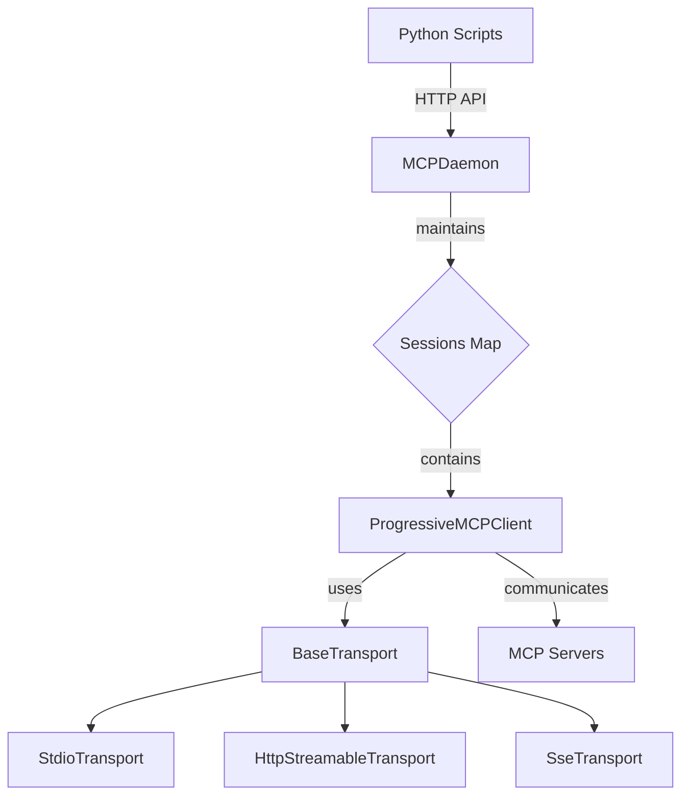

# Project Context
> 最後更新：2026-01-13

## 專案概述

**mcp-progressive-client** 是一個概念驗證專案，目標是驗證 AgentSkills.io 的漸進式揭露模式在 MCP (Model Context Protocol) 領域的適用性。

**核心價值**：透過三層漸進載入，大幅降低 MCP 工具使用時的 token 消耗（預期可節省 86%）。

**實驗性質**：這是一個早期 demo 版本，不建議直接用於生產環境。

---

## 技術棧

- **語言**：TypeScript (Node.js 18+), Python 3.8+
- **主要依賴**：
  - `@modelcontextprotocol/sdk` - MCP 協議實現
  - `aiohttp` - Python HTTP client (async)
- **建置工具**：npm + tsc (TypeScript compiler)
- **測試框架**：node --test (內建測試)
- **Transport 支援**：stdio, http-streamable, SSE

---

## 專案結構

```
mcp-progressive-client/
├── daemon/                    # Daemon 實現 (TypeScript)
│   ├── src/
│   │   ├── index.ts          # 主入口，export API
│   │   ├── client.ts         # ProgressiveMCPClient 核心類
│   │   ├── types/            # TypeScript 類型定義
│   │   ├── transports/       # Transport 層實現
│   │   │   ├── base.ts       # BaseTransport 抽象類
│   │   │   ├── stdio.ts      # stdio transport
│   │   │   ├── http-streamable.ts
│   │   │   └── sse.ts
│   │   └── daemon/           # HTTP Daemon 服務器
│   │       └── mcp-daemon.ts # MCPDaemon 主類
│   ├── dist/                 # 編譯後的 JavaScript
│   ├── package.json
│   └── tsconfig.json
├── scripts/                  # Python CLI 腳本
│   ├── setup.py              # 安裝與建置
│   ├── daemon_start.py       # 啟動 daemon
│   ├── daemon_reload.py      # Hot reload 配置
│   ├── daemon_shutdown.py    # 關閉 daemon
│   ├── mcp_metadata.py       # Layer 1: 取得 metadata
│   ├── mcp_list_tools.py     # Layer 2: 列出工具
│   ├── mcp_tool_schema.py    # Layer 3: 取得工具 schema
│   ├── mcp_call.py           # 呼叫工具
│   ├── mcp_session.py        # 多工具 session
│   └── mcp_close.py          # 關閉 session
├── mcp-servers.json          # MCP servers 配置
├── SKILL.md                  # Skill 使用說明
├── README.md                 # 專案文件
└── README_zhTW.md            # 繁體中文版
```

### 目錄職責

| 目錄/檔案 | 職責 |
|-----------|------|
| `daemon/src/client.ts` | ProgressiveMCPClient - 三層漸進載入核心實現 |
| `daemon/src/daemon/mcp-daemon.ts` | MCPDaemon - HTTP API 服務器，管理持久化連接 |
| `daemon/src/transports/` | Transport 層 - 支援 stdio/http-streamable/sse 三種傳輸方式 |
| `scripts/` | Python CLI 工具 - 對外使用的命令行介面 |
| `mcp-servers.json` | MCP servers 配置檔案 |

---

## 程式碼慣例

### TypeScript

- **命名規則**：
  - Class: `PascalCase` (e.g., `ProgressiveMCPClient`, `MCPDaemon`)
  - Method/Property: `camelCase` (e.g., `getMetadata`, `handleRequest`)
  - Interface/Type: `PascalCase` (e.g., `MCPServerConfig`, `SessionInfo`)

- **匯入順序**：
  1. Node.js 內建模組
  2. 外部依賴 (npm)
  3. 本地模組 (相對路徑)

- **錯誤處理**：
  - 使用 `try/catch` 包裝 async 操作
  - 拋出 Error 物件而非字串
  - Daemon 透過 HTTP status code + JSON error message 回傳錯誤

- **狀態管理**：
  - ProgressiveMCPClient 使用私有屬性 (`_metadata`, `_toolsCache`)
  - Daemon 使用 `Map<string, SessionInfo>` 管理 sessions
  - Session 包含 `lastActivityAt` 用於追蹤活躍狀態

### Python

- **命名規則**：
  - Function: `snake_case` (e.g., `get_metadata`, `handle_request`)
  - Class: `PascalCase` (e.g., 如有)

- **異步處理**：
  - 使用 `asyncio.run(main())` 啟動
  - 使用 `async with aiohttp.ClientSession()` 管理 HTTP 連接

- **輸出格式**：
  - 使用 `json.dumps()` 統一輸出 JSON
  - 包含 `success` 欄位表示成功/失敗
  - 失敗時設定 `sys.exit(1)`

---

## 模組依賴



### 核心流程

1. **啟動**：`daemon_start.py` → 啟動 MCPDaemon
2. **Preconnect**：MCPDaemon 連接至 mcp-servers.json 配置的 servers，建立 Global Sessions
3. **請求**：Python scripts → HTTP POST → MCPDaemon → ProgressiveMCPClient → MCP Server
4. **Hot Reload**：`daemon_reload.py` → POST /reload → 重新載入配置並重連
5. **關閉**：`daemon_shutdown.py` → POST /shutdown → 優雅關閉所有連接

---

## 設計亮點

### 1. 三層漸進載入 (Progressive Disclosure)

- **Layer 1 (Metadata)**：只載入 server 名稱、版本 (~50-100 tokens)
- **Layer 2 (Tool List)**：載入工具名稱 + 描述 (~200-400 tokens)
- **Layer 3 (Tool Schema)**：只載入需要用到的工具完整 schema (~300-500 tokens/tool)

**效果**：假設 20 個工具只用 2 個，從 6000 tokens 降到 850 tokens（節省 86%）。

### 2. Daemon 架構

- 長期運行的 HTTP 服務器，維持持久化 MCP 連接
- 避免每次請求都重新連接 MCP server 的開銷
- 支援 Hot Reload，修改配置後無需重啟 daemon

### 3. Session 管理

- **Global Session**：預連接，所有請求共享（ID 格式：`{server}_global`）
- **Dynamic Session**：按需創建，特定用途（未完整實現）
- 包含 `lastActivityAt` 追蹤，預留清理 idle sessions 的能力

### 4. Transport 抽象層

- `BaseTransport` 定義統一介面
- 支援三種傳輸方式：stdio (本地), http-streamable (遠端串流), SSE (事件驅動)
- 透過 Transport Type 工廠模式創建

### 5. ESM Module

- 使用 `type: module`，採用 ES Modules
- Export 清晰的 API 介面

---

## 已知技術債 / 待改進項

1. **Dynamic Session 未完整實現**：目前只有 Global Session，Dynamic Session 機制尚未完整實現
2. **Idle Session 清理未實現**：`cleanupIdleSessions()` 方法存在但未實現邏輯
3. **錯誤處理不統一**：Python scripts 的錯誤處理格式不完全一致
4. **測試覆蓋率不足**：目前沒有看到具體的測試檔案
5. **日誌系統簡陋**：只有 `console.log`，沒有結構化日誌
6. **配置驗證不足**：mcp-servers.json 格式驗證不嚴格
7. **CORS 支援**：目前 CORS 為預設啟用但可選，安全性需考慮
8. **認證機制缺失**：HTTP API 沒有認證，任意客戶端可訪問

---

## 最近變更

- 2026-01-13：修正配置檔案路徑讀取
  - daemon_start.py 修正 project_root 計算（從 `daemon/dist/parent` 改為 `daemon/dist/parent/parent`）
  - daemon_start.py 透過 `MCP_DAEMON_CONFIG` 環境變數傳遞根目錄配置路徑
  - daemon 的 loadServerConfigs() 優先讀取 `MCP_DAEMON_CONFIG` 環境變數
  - 配置檔案位置優先順序：
    1. `MCP_DAEMON_CONFIG` 環境變數
    2. 專案根目錄 `mcp-servers.json`
    3. `config/mcp-servers.json`
  - 更新 README.md 和 README_zhTW.md 說明配置檔案位置優先順序
- 2026-01-13：新增 description 欄位支援
  - MCPServerConfig 新增 description 欄位
  - ProgressiveMCPClient.connect() 將 description 賦值到 metadata
  - 新增 GET /metadata endpoint
  - mcp_metadata.py 改用新 endpoint
  - 更新 README 文件說明
- 2026-01-13：建立專案 Context 文件（初始化）
- 2026-01-13：修復 Layer 1 metadata 無法獲取的問題
  - 新增 ProgressiveMCPClient.getCachedMetadata() 方法
  - Daemon 新增 GET /metadata endpoint
  - mcp_metadata.py 改用新 endpoint 取得真正 metadata

---

## 配置說明

### mcp-servers.json

```json
{
  "servers": {
    "playwright": {
      "transportType": "stdio",
      "command": "npx",
      "args": ["@playwright/mcp@latest", "--isolated"]
    }
  }
}
```

### Environment Variables

- `MCP_DAEMON_PORT`：Daemon HTTP port（預設 13579）

---

## API Endpoints

| Method | Path | 說明 |
|--------|------|------|
| GET | `/health` | 健康檢查 |
| GET | `/metadata?sessionId=xxx` | 取得 MCP server metadata（Layer 1） |
| POST | `/connect` | 取得 Global session ID |
| POST | `/call` | 呼叫 MCP 工具 |
| POST | `/request` | 通用 JSON-RPC 請求轉發 |
| DELETE | `/disconnect` | 斷開 Dynamic session |
| DELETE | `/sessions/:id` | 關閉特定 session（包含 Global） |
| POST | `/sessions/:id/reconnect` | 重新連接 Global session |
| POST | `/reload` | Hot Reload 配置 |
| POST | `/shutdown` | 優雅關閉 Daemon |

---

## Python Scripts 對照表

| Script | Layer | 說明 | 範例 |
|--------|-------|------|------|
| `mcp_metadata.py` | Layer 1 | 取得 server metadata | `--server playwright` |
| `mcp_list_tools.py` | Layer 2 | 列出可用工具 | `--server playwright` |
| `mcp_tool_schema.py` | Layer 3 | 取得工具完整 schema | `--server playwright --tool browser_navigate` |
| `mcp_call.py` | - | 呼叫工具 | `--server playwright --tool browser_navigate --params '{"url":"..."}'` |
| `mcp_session.py` | - | 多工具批次執行 | `--server playwright --script session.json` |
| `mcp_close.py` | - | 關閉 session | `--session-id xxx` |

---

## 開發注意事項

1. **先啟動 Daemon**：所有 scripts 都依賴 daemon 運行
2. **使用 Global Session**：目前 scripts 預設使用 `{server}_global` session
3. **Hot Reload**：修改 mcp-servers.json 後執行 `daemon_reload.py` 即可
4. **Transport Type**：必須配置正確的 transportType 對應參數（stdio 需要 command，http/sse 需要 url）
5. **自訂 Description**：可在 mcp-servers.json 為每個 MCP server 加上 `description` 欄位，AI 在 Layer 1 metadata 中取得此說明
6. **配置檔案位置**：Daemon 優先從專案根目錄讀取 `mcp-servers.json`（透過 `MCP_DAEMON_CONFIG` 環境變數傳遞）

## Description 欄位功能

**問題**：部分 MCP server（如 Playwright）在 initialize 階段不提供 description，導致 AI 無法從 Layer 1 metadata 了解 server 用途。

**解決方案**：在 `mcp-servers.json` 中為各 MCP server 加入自訂 `description` 欄位。

**實作方式**：
- `MCPServerConfig` 新增 `description?: string;`
- `ProgressiveMCPClient.connect()` 將 config 的 description 賦值到 `_metadata`
- 若 config 未提供 description，metadata 將不包含此欄位（選項 A 行為）

**範例**：
```json
{
  "servers": {
    "playwright": {
      "description": "Browser automation tool for web navigation, screenshots, clicks, form filling, and more",
      "transportType": "stdio",
      "command": "npx",
      "args": ["@playwright/mcp@latest", "--isolated"]
    },
    "filesystem": {
      "description": "Filesystem operations tool for reading, writing, and searching files",
      "transportType": "stdio",
      "command": "npx",
      "args": ["-y", "@modelcontextprotocol/server-filesystem", "/path/to/directory"]
    }
  }
}
```
